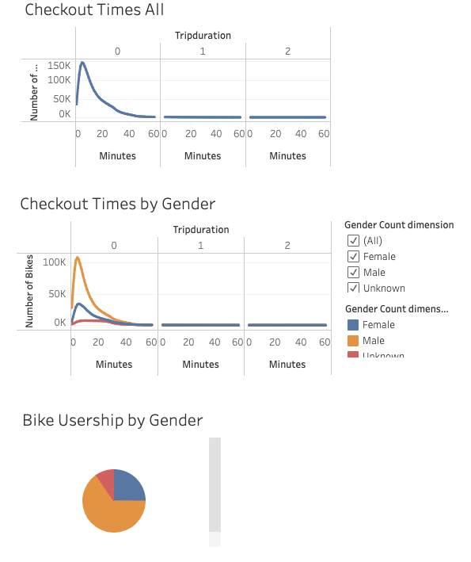
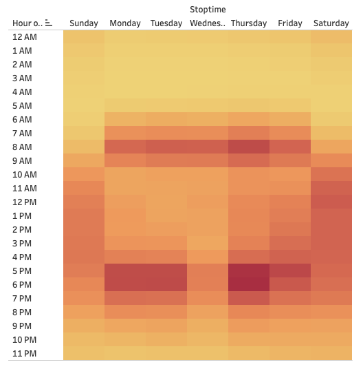
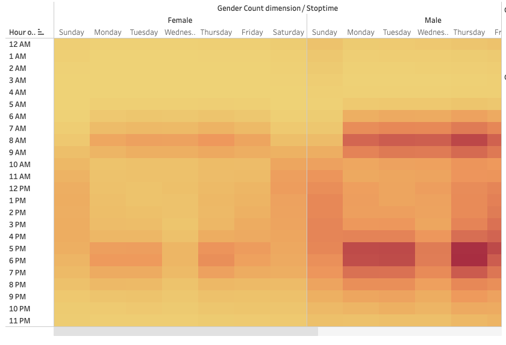
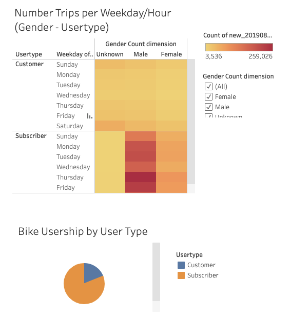

# Bikesharing

[link to dashboard](https://public.tableau.com/app/profile/kristen.chang/viz/NYCitiBikeStory/NYCCitiBikeStory)

## Overview
In this project, we use Tableau to analyze and visualize NY Citi Bike data. Insight gleaned will be used in a business propoal and for the implementation of bike sharing program in Des Moines. We look at items such as user types, gender differrences, and popular times for rides.

## Results

- Check Out Times All: Most bike rides are under 60 minutes in duration, with majority being under 20 minutes.
- Check Out Times by Gender: The same is true across genders. However, there are more rides taken by males than females than unknown.
- Pie Chart, Rider Gender Breakdown: We can see that 588,431 citibike users are female, 1,530,272 users are male, and 225,521 are unknown.

- In this heatmap we see that most trips are taken on weekend days and weekday rush hour (8am and 5-6pm).

- This heatmap is divided by gender. We see the same day/time riding trends and as previously found, fewer female riders than male.

- Heatmap Trip Times: There is no difference between male and female ridership for non-subscriber customers. Among subscribers, there are more male users. Males are larger part of Citibikes consumer base.
- Pie Chart Usership Breakdown: There are more regular customers (subscribers to Citibike membership) than non-subscriber customers.

## Summary
Overall, we have established popular ride times, a largely male customer base, and high subscriber user rate. Based on these findings, it would be good to ensure that there are enough bikes for peak hours and that repairs are done during non-busy hours. It would be helpful to visualize bike routes and station locations to see where placement of stations should be. Visualizing the relationship between population density in certain parts of city to frequency of bike start/stop locations would be helpful to understand where to place bike stations. One thing to note is these findings are for NY, and conditions may not be reflective of those in Des Moines. 
